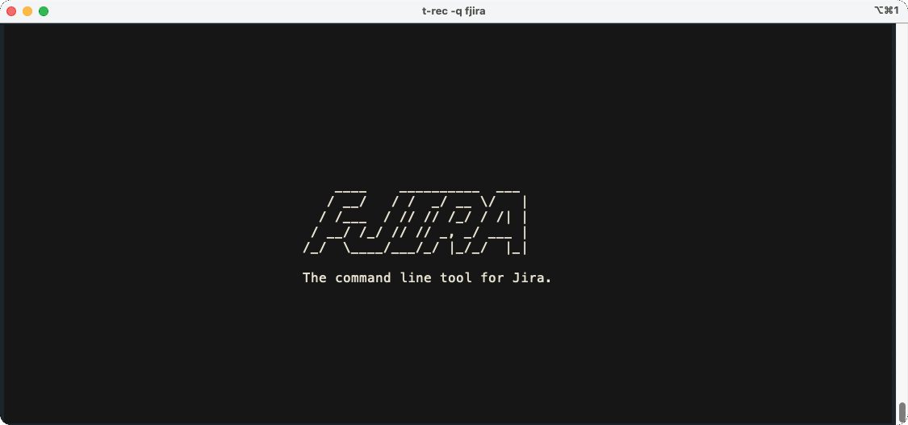
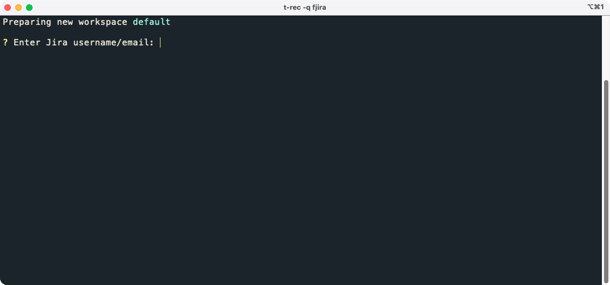
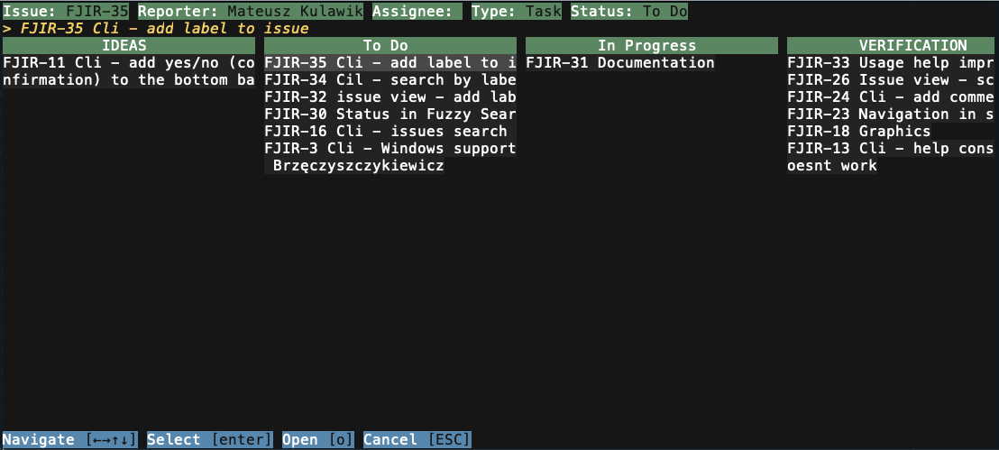
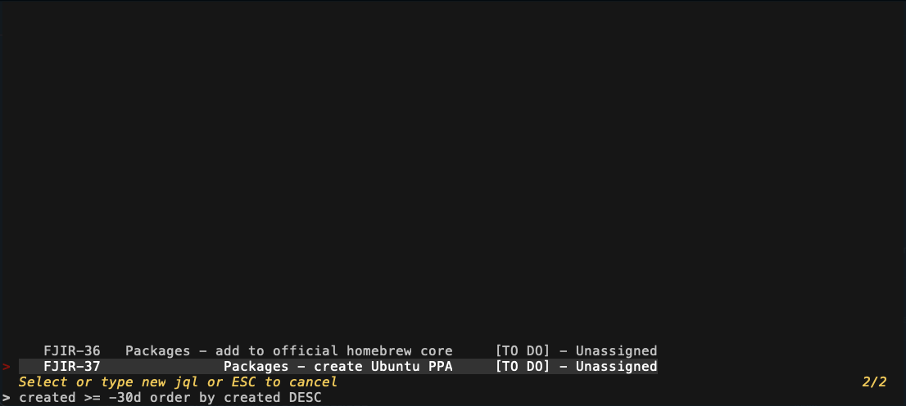

# Fjira - Fuzzy finder and TUI application for Jira.


[](https://github.com/mk-5/fjira/blob/master/LICENSE)

[](https://goreportcard.com/report/github.com/mk-5/fjira)
[](https://pkg.go.dev/github.com/mk-5/fjira)
[](https://codecov.io/gh/mk-5/fjira)

## Introduction

Fjira is a powerful command-line tool designed to simplify your interactions with Jira. Whether you're a developer, project manager, or just a Jira enthusiast, Fjira streamlines your workflow, making Jira tasks more efficient than ever before.



## Key Features

- **Fuzzy-find like interface:** Search for Jira projects and issues with ease.
- **Assignee Control:** Quickly change issue assignees without navigating the Jira interface.
- **Status Updates:** Update Jira issue statuses directly from your terminal.
- **Efficient Comments:** Easily append comments to Jira issues.
- **Multi-Workspace Support:** Manage multiple Jira workspaces effortlessly.
- **Custom Searches:** Use Jira Query Language (JQL) for tailored searches.
- **Direct CLI Access:** Access Jira issues directly from the command line.
- **Cross-Platform Compatibility:** Works seamlessly on macOS, Linux, and Windows.

## Installation

### macOS

```shell
brew tap mk-5/mk-5
brew install fjira
```

### Linux

#### Ubuntu/Snap

```shell
snap install fjira
```

#### Deb

Visit [https://github.com/mk-5/fjira/releases/latest](https://github.com/mk-5/fjira/releases/latest), and grab the
latest release version.

```shell
sudo dpkg -i fjira_0.4.0_linux_amd64.deb
```

#### Binary

```shell
tar -xvzf fjira_0.4.0_Linux_x86_64.tar.gz
cp fjira /usr/local/bin/fjira
```

### Windows

```shell
choco install fjira
```

### Build from sources

```shell
make
./out/bin/fjira
```

## Usage

```text
Usage:
  fjira [flags]
  fjira [command]

Available Commands:
  [issueKey]  Open a Jira issue directly from the CLI
  completion  Generate the autocompletion script for the specified shell
  help        Help about any command
  jql         Search using custom JQL queries
  version     Print the version number of fjira
  workspace   Switch to a different workspace

Flags:
  -h, --help             help for fjira
  -p, --project string   Open project directly from cli

Additional help topics:
  fjira            Open fuzzy-find for projects as a default action

Use "fjira [command] --help" for more information about a command.
```

## Getting Started

Using the Fjira CLI is straightforward. Simply run fjira in your terminal.

```shell
fjira
```

## Workspaces

The first time you run Fjira, it will prompt you for your Jira API URL and token.



Fjira workspaces store Jira configuration data in a simple YAML file located at `~/.fjira`. You can switch between multiple workspaces using the `fjira workspace` command.

```shell
fjira workspace
```

To create a new workspace, use the following command:

```shell
fjira workspace --new abc
```

You can edit an existing workspace using the `--edit` flag:

```shell
fjira workspace --edit abc
```

### Jira Token Type

Fjira supports both Jira Server and Jira Cloud, which use different token types for authorization. The tool will prompt you to select the appropriate token type during workspace configuration.

```shell
? Jira Token Type:

1. api token
2. personal token

Enter a number (Default is 1):
```

## Projects search

The default view when you run `fjira` is the project search screen.

```shell
fjira
```

## Opening a Specific Project

You can open a project directly from the CLI:

```shell
fjira --project=PROJ
```

This will skip the project search screen and take you directly to the issues search screen.

## Opening an Issue Directly

To open an issue directly from the CLI:

```shell
fjira PROJ-123
```

Fjira will skip all intermediate screens and take you directly to the issue view.


## Boards View

Fjira also offers a board-like view. After opening a project, press F4 to access this view.



## Custom JQL Queries

You can create and execute custom JQL queries with Fjira:



## Roadmap (TODO)

- Expand Documentation
- Support Additional Linux Package Managers (Apt, AUR, YUM)
- Introduce More Jira Features

## Motivation

Fjira was designed for personal convenience, born out of a desire for efficiency and a love for terminal tools.
Often, we find ourselves in "I just need to transition issue 123 to the next status." While opening Jira, locating the ticket on the board, and navigating the Jira issue modal are all perfectly fine, they do consume a fair amount of time.

Fjira empowers you to execute such tasks directly from the terminal, where you're likely already working! 😄

If Fjira enhances your Jira experience as it did mine, please consider giving it a star on GitHub. 🌟 It will power-up me for a future work.

Feel free to contribute to this project and help shape its future! Your feedback and contributions are highly appreciated.
