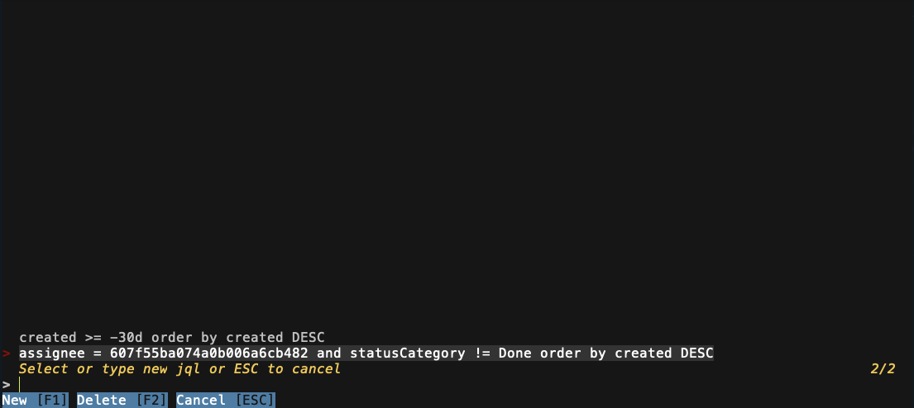

# Fjira - the fuzziest Jira command line tool in the world.


[](https://github.com/mk-5/fjira/blob/master/LICENSE)

[](https://goreportcard.com/report/github.com/mk-5/fjira)
[](https://pkg.go.dev/github.com/mk-5/fjira)
[](https://codecov.io/gh/mk-5/fjira)

## Demo


## Features

- Search for Jira Projects, and Issues
- Change Jira Issue assignee
- Update Jira Issue status
- Append comments to Jira Issue
- Multi-Workspace support
- Perform custom searches using JQL
- Access Jira Issues Directly via Command Line 
- Cross-Platform Compatibility: macOS, Linux, and Windows

## Install

### Mac OS

```shell
brew tap mk-5/mk-5
brew install fjira
```

### Linux

Go to [https://github.com/mk-5/fjira/releases/latest](https://github.com/mk-5/fjira/releases/latest), and check the
latest release version.

#### Ubuntu/Snap

```shell
snap install fjira
```

#### Deb

```shell
sudo dpkg -i fjira_0.4.0_linux_amd64.deb
```

#### Binary

```shell
tar -xvzf fjira_0.4.0_Linux_x86_64.tar.gz
cp fjira /usr/local/bin/fjira
```

### Windows

```shell
choco install fjira
```

### Build from sources

```shell
make
./out/bin/fjira
```

## Usage

```text
Usage:
  fjira [flags]
  fjira [command]

Available Commands:
  [issueKey]  Open jira issue directly from the cli
  completion  Generate the autocompletion script for the specified shell
  help        Help about any command
  jql         Search using custom-jql
  version     Print the version number of fjira
  workspace   Switch workspace to another

Flags:
  -h, --help             help for fjira
  -p, --project string   Open project directly from cli

Additional help topics:
  fjira            Open fuzzy-find for projects as a default action

Use "fjira [command] --help" for more information about a command.
```

## Getting Started

The CLI Jira interface is pretty straightforward. Just run `fjira` in your terminal.

```shell
fjira
```

## Workspaces

Fjira will ask you about Jira API url, and token if you run fjira for the very first time.


Fjira workspace is a set of jira configuration data, and it's kept in simple yaml file under `~/.fjira` directory.
You can switch within multiple workspaces using `fjira workspace` command.

```shell
fjira workspace
```

It will open a fuzzy finder with all available workspaces.
In order to create a new workspace you need to use following command:

```shell
fjira workspace --new abc
```

You can edit existing workspace using `--edit` flag.

```shell
fjira workspace --edit abc
```

### Jira Token Type

Jira Server, and Jira Cloud are using different kinds of tokens for authorization. Please check, which token do you have
before
workspace configuration. Fjira will ask you about Jira Token Type:

```shell
? Jira Token Type:

1. api token
2. personal token

Enter a number (Default is 1):
```

## Projects search

The projects search is a default view, just run `fjra` in order to open it.

```shell
fjira
```

## Open concrete project directly from cli

You can open a project directly from cli.

```shell
fjira --project=PROJ
```

The fjira app will skip projects search screen, and it'll go to the next screen with issues search.

## Open issue directly from cli

```shell
fjira PROJ-123
```

The app will skip all the screens, and it'll go to the issue view directly.

## Board View


You can open board-like view using the navigation buttons from the project menu.
First open the project, and then press F4.

## Custom JQL View



You can write your custom JQLs, and use them to search for Jira issues.

```shell
fjira jql
```

## The Future (TODO)

- More docs
- Support Linux packages managers nonsense aka. Snapcraft, Deb, AUR
- More Jira features ;)

#### Motivation

I designed this tool with personal convenience in mind, motivated by a touch of laziness (and a genuine fondness for
terminal tools).

It's a common scenario where you think to yourself, 'I just need to transition issue 123 to the next status.' While
opening Jira, locating the ticket on the board, and navigating the Jira issue modal are all perfectly fine, they do
consume a fair amount of time.

I found it incredibly useful to execute such tasks directly from the terminal, especially since I'm likely to be working
there anyway! 😝"

Sooo, if you feel it the same way as me - I'd love to get some star from you 🤜🤛
